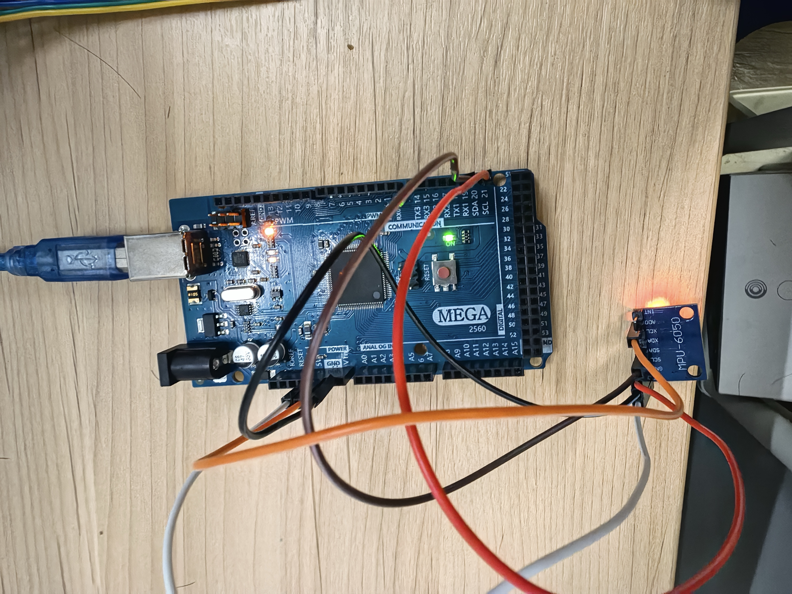
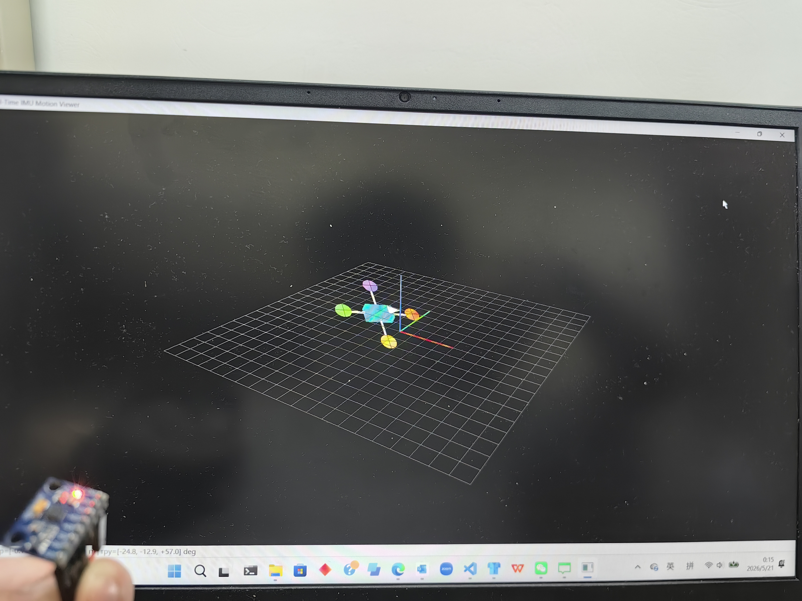

# Real Time MPU6050 Inertial Sensing and 3D Motion Visualization Using Arduino Mega and Python

A real-time inertial sensing and visualization system based on the MPU6050 IMU, Arduino Mega, Python, and OpenGL.

## Overview

This project implements a complete real-time sensing pipeline:

MPU6050 → Arduino Mega → Serial Communication → Python → SO(3) Attitude Estimation → 3D Visualization

The system acquires 6-axis inertial measurements at 500 Hz, performs sensor calibration and attitude estimation, and visualizes the estimated motion in real time.

## Features

- 6-axis accelerometer and gyroscope acquisition
- 500 Hz MPU6050 sampling
- 250-sample initial calibration
- Gyroscope bias compensation
- SO(3)-based attitude propagation
- Gravity-based roll/pitch correction
- Acceleration deadband and drift mitigation
- Real-time OpenGL visualization

## Hardware

- Arduino Mega 2560
- MPU6050 IMU

## Software

- Arduino C/C++
- Python
- NumPy
- PySerial
- PyQt6
- PyOpenGL

## Demo

## Usage

1. Upload `MPU6050/MPU6050.ino` to the Arduino Mega.
2. Connect the MPU6050 through I2C.
3. Install the required Python packages.
4. Run:

`python imu_visualization.py`

## Report

A detailed project report is included in this repository.
